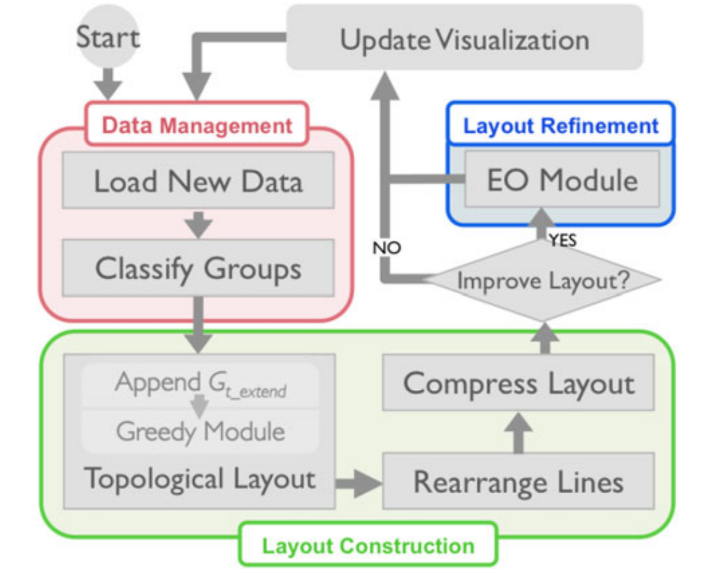
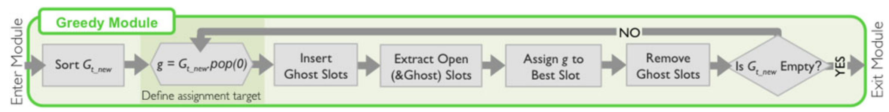
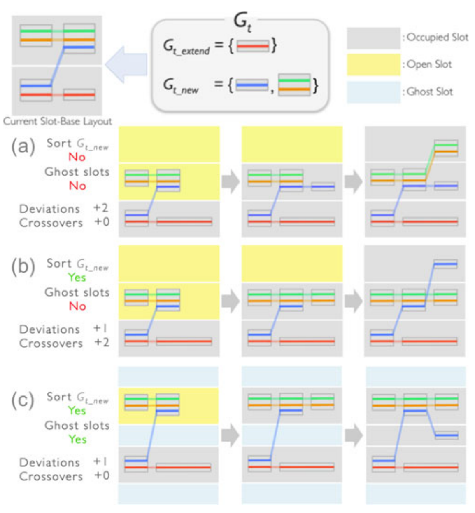
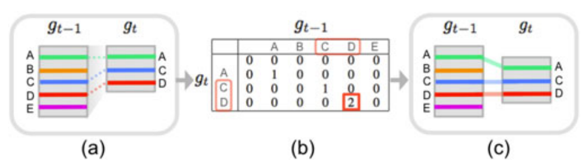
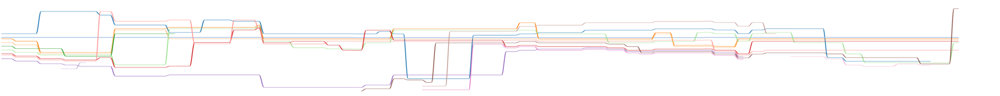
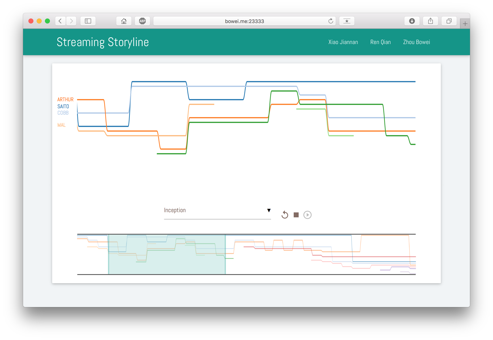

# Storyline Visualization for Streaming Data

* 任　谦 | 2016213592
* 肖剑楠 | 2016213589
* 周伯威 | 2016213588

## 1. 项目介绍

### 1.1 背景

对于一个故事，人物——或称**实体**(entities)——之间的关系通常是随着时间而发展、变化的。**故事线**(storyline)是便是描述这种变化的关系的一种很好的可视化手段。

在故事线的可视化案例中，横轴的正方向表示时间的发展方向，水平方向延伸的各条曲线用于表示各个人物，而竖直方向上若干曲线相互聚拢则表示在此时间片这些人物具有某种关系。

### 1.2 相关工作

我们的工作主要参考了以下四篇文章。

[1] Ogawa, Michael, and Kwan-Liu Ma. "Software evolution storylines." *Proceedings of the 5th international symposium on Software visualization*. ACM, 2010.

[2] Tanahashi, Yuzuru, and Kwan-Liu Ma. "Design considerations for optimizing storyline visualizations." *IEEE Transactions on Visualization and Computer Graphics* 18.12 (2012): 2679-2688.

[3] Liu, Shixia, et al. "Storyflow: Tracking the evolution of stories." *IEEE Transactions on Visualization and Computer Graphics* 19.12 (2013): 2436-2445.

[4] Tanahashi, Yuzuru, Chien-Hsin Hsueh, and Kwan-Liu Ma. "An efficient framework for generating storyline visualizations from streaming data." *IEEE transactions on visualization and computer graphics* 21.6 (2015): 730-742.

故事线这种可视化表现手法最早由XKCD完成，但他们的故事线是手绘的。后来，Tanahashi与Kwan-Liu Ma等人使用计算机完成了这一工作。由他们的方法生成的故事线很美观，但代价是需要长达十几个小时的计算时间，难以进行实时的交互。再后来，刘老师等改进了他们的方法，使用LOD技术解决了性能低下的问题，并实现了可交互的故事线。

## 2. 实现方法
### 2.1 运行环境

Python: 3.5.1

* Python packages: flask, numpy

NodeJS: 7.2.1

* NodeJS packages: request, body-parser, express

Optimization Library: Mosek

### 2.2 算法部分

在故事线中，角色随着情节的进行与其他角色组成团队，在不同的地点和场景共同行动。为形式化的表现角色之间的合作关系，我们称故事线中的每一位角色为实体(entity)，在一个时期共同行动的角色归入同一个组(group)中。
由此，故事线每一时刻的流数据称为Slice，表示为如下形式：

由表一可以看出，实体随时间线的进行产生明显的增减变化，并且在不同的小组间穿梭。为了在清晰展示实体变化情况的同时合理布局，建立了以下三个布局优化原则。
* P1：相同小组的线应该紧密排列* P2：不同小组的线应分离* P3：若实体的小组归属没有发生变化，应尽量减少故事线偏离
  为此，形成了以下三个具体优化目标：* D1：最小化故事线偏移* D2：最小化线交叉* D3：最小化屏幕空间占用计算故事线的偏移，首先需要了解该时刻流数据与前一刻流数据之间的差别。当前一个分组内的实体分离到后继两个小组中时，故事线将以极大可能性产生交叉，为此需要调整后继Slice内小组的相对顺序。因此，我们设计如下的处理模块。

Slice数据经过`Data Management`模块预处理，其中的所有Group被划分为`New Group`和`Extend Group`两种类型。保持`Extend group`相对顺序不变，`Layout Construction`采用贪心算法将`New Group`合理插入到排列中，最后确定每个Entity的具体坐标。下面，我们将从分三个部分对此介绍算法。

#### 2.2.1 分类(classify)

对于时刻$t$，记为$S_t$，其小组组成为$S_t=\{g_{t-1},g_{t-2},\dots, g_{t-k},\dots\}$，因此前一时刻可记为$S_t$。若一个小组$g_t$属于$S_t$，且$g_t$属于$S_{t-1}$，则$g_t$划分为`Extend group`类，否则归为`New Group`类。如下所示

$g_{t_k}\in\begin{equation} \begin{cases} G_{t\_extend}, \rm if\ g_{t_k} \in G_{t-1}, t>0 \\\ G_{t\_new} , \rm otherwise. \end{cases}\end{equation}$

以Table1为例，0时刻Slice0中包含两个小组`{Alice,Bob}`、`{Chad}`，对于后继时刻Slice1，其中也包含`{Alice,Bob}`、`{Chad,Dimitri}`两个小组。按照分类规则可知，因为`{Alice,Bob}`属于Slice1并且属于Slice0，因此划分为`Extend Group`，同理可知`{Chad,Dimitri}`归为`New Group`。

#### 2.2.2 排列(ordering)

对`New Group`中的每个小组，计算其与前一小组的相似度，取最大值。相似度定义为，对于一个属于$S_t$的小组$g_t$和前一时刻$S_{t-1}$，如果存在$n$个实体同时属于$g_t$和$S_t$中的某个小组，取其中最大的$n$作为$g_t$的相似度。

$$MaxCommon(g_{t_k})=\max_{\forall g\in G_{t-1}}|g_{t_k}\cap g|.$$对`New Group`以相似度降低顺序排序，得到`NG-Ordered`，然后采用贪心策略依次分配`New Group`中的每个小组到`Extend Group`中。

在分配中，可能出现$S_t$中的不同小组与$S_{t-1}$中的同一个相似或欲插入的slot已经被占用，为此需要引入`Ghost slot`。其使用如下。

当能够产生更少的交叉时，在相邻排列的已占用slot之间插入`Ghost Slot`用以填充`New Group`中的小组。由此获得交叉数最少的小组排序。

#### 2.2.3 对齐(align)

$S_t$中所有小组的排序确定之后，要获得具体的坐标以使故事线偏离最小，还需要对齐操作。如下图所示

若$S_t$中的小组$g_t$与$S_{t-1}$中的$g_{t-1}$相似，计算两小组中实体的最长公共连续子序列，坐标计算应尽量保持最长子序列中实体在$S_{t-1}$和$S_{t-2}$中坐标相同。如上图所示，$g_t$与$g_{t-1}$对应，其实体分别为`{A,B,C,D,E}`和`{A,C,D}`，相似度为3，然而最长公共连续序列为`{C,D}`，为此，计算坐标时，应令`{C，D}`坐标与$g_{t-1}$中相同。$g_t$中其他实体按照组内最小间距依次排列。如下图所示

考虑到$S_t$中的不同组$g_{t-1}$和$g_{t-b}$可能与$S_{t-1}$中的同一个组对应，因此不可能对所有小组采用对齐操作。此时，贪心算法决定，首先对公共连续子序列最长的小组进行对齐操作。

### 2.3 可视化部分

#### 2.3.1 Storyline

Storyline的实现效果如图所示，其中每一条连续的线段代表一个实体的变化情况，位于视图左侧的图例显示了每个实体的名字，并与线段的最左端保持高度一致。

Storyline支持Straighten交互操作，点击其中一条线段，可以将这条线段变直，从而清晰的显示这个实体与其他实体的交互关系，可以方便对单个实体进行观察。当时间序列逐渐增长时，可以通过调节Minimap的显示尺度来对Storyline进行横向放缩，从不同的时间粒度观察布局结果。

#### 2.3.2 Minimap

与Storyline不同，Minimap不涉及动画效果、视图的改变，因此可使用比D3.js更加简单的canvas绘制。每当重新绘制svg时，canvas也将进行刷新。

Minimap的鼠标事件被绑定在canvas上方同样大小的一个透明div上，操作选择框选择一个时间区域即可更新Storyline的视图。

### 2.4 通信部分

网页前端通过`EventSource`与服务器建立起一个长连接，收听后端的数据包。接下来，每当其接收到后端发来的数据包，便将数据交给可视化模块，将其绘制出来。

服务器的Nodejs程序负责给前端传送数据。当它与前端建立起长连接后，便根据前端所请求的电影名称，从数据集中读取对应的数据文件。接着将数据文件被解析成方便处理的格式。然后，Nodejs程序通过`child-process`工具包中的`spawn`函数生成一个子进程，调用用于处理数据的C++程序。Nodejs程序通过管道与C++程序的标准输入输出相连接，便实现了数据的交换。

Nodejs程序每隔一段时间会给C++程序发送一个新的时间片的数据，用于模拟流数据不断产生的过程。得到C++程序的输出后，Nodejs程序将输出打包发送回前端。

## 3. 实现结果

我们使用Yuzuru[4]中使用的数据集，包括Star Wars, The Matrix, Inception。

以下为我们的实验结果与Yuzuru布局结果的对比。

Star Wars result by Yuzuru

Star Wars result by ours

Inception result by Yuzuru

Inception result by ours

程序界面:

## 4. 成员工作

| Member       | Framework & Layout Algorithm | Visualization              |
| ------------ | ---------------------------- | -------------------------- |
| Bowei Zhou   | Client / Server              | Minimap, Animation         |
| Qian Ren     | Layout (Ordering, Aligning)  | Parameter Refine           |
| Jiannan Xiao | Layout (Compaction)          | Visualization, Interaction |

## 5. 对课程的建议

* 增加小作业，分担大作业的工作量。
* 增加对大作业的指导，例如，在中期的时候检查进度，并根据完成情况给工作提出建议等。
